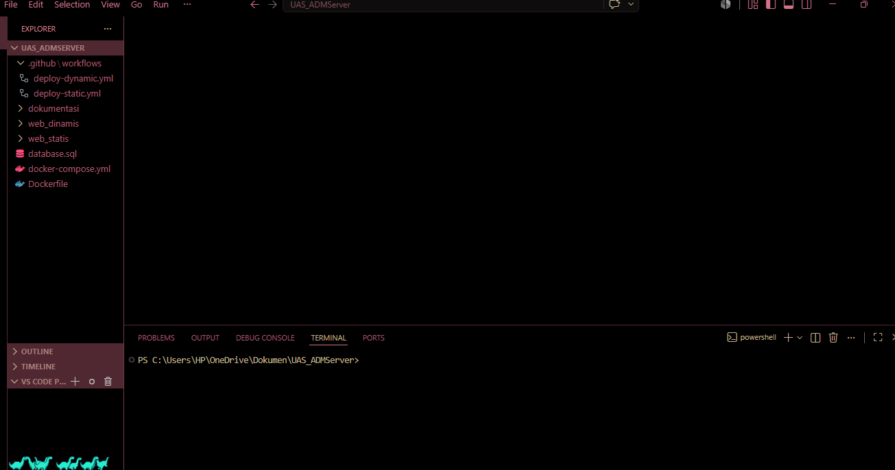
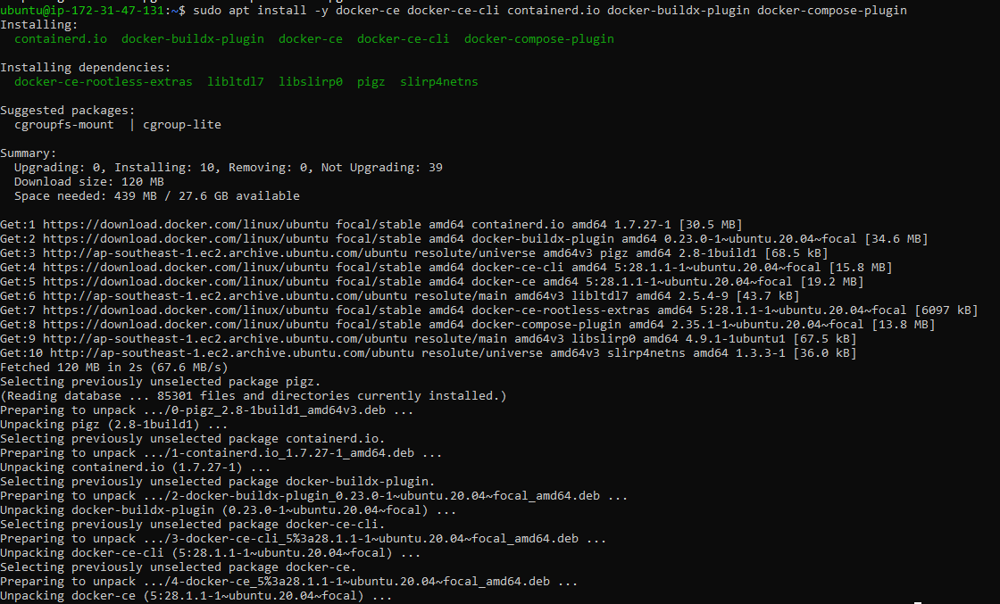
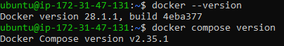
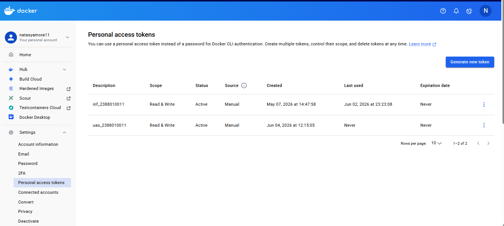
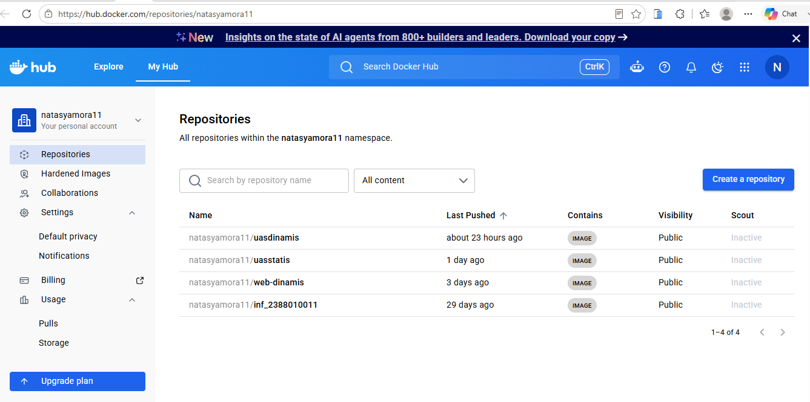
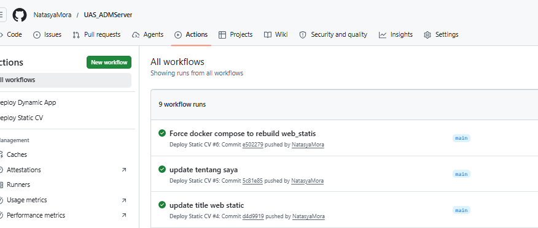
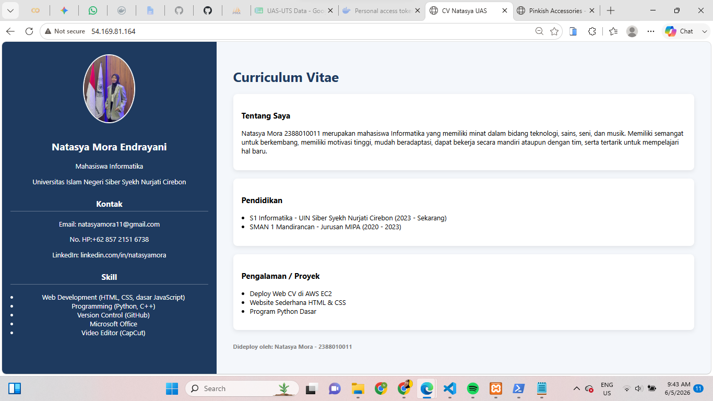

# UAS

1. Buat Instance baru

2. Membuat Folder Project

3. Installasi Docker 

2. Buat Repositori di Docker

   Personal Acsess Tokens

   Pastikan Terhubung

3. Push Project dan Set-up Github Secret

4. Set up Github Action

5. Test Menjalankan Web Statis dan We Dinamis

6. Mencoba Update Little dari "CV Natasya" => "CV Natasya UAS"

