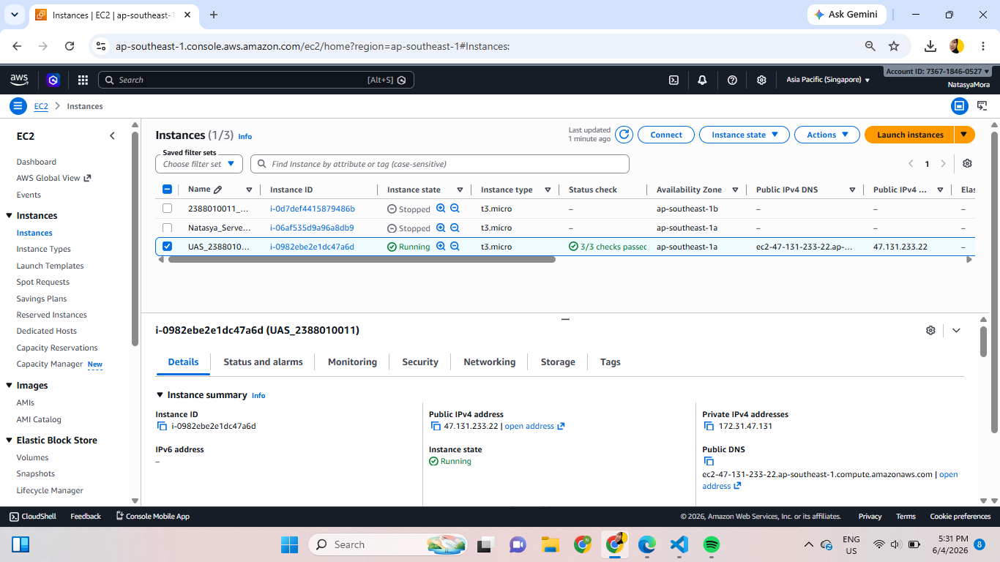
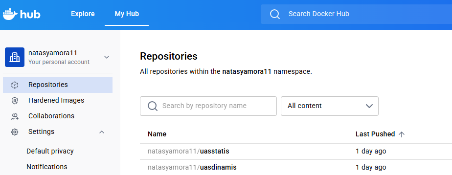
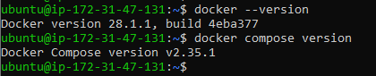
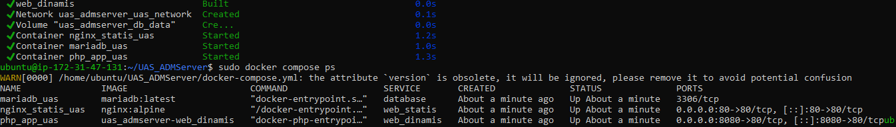
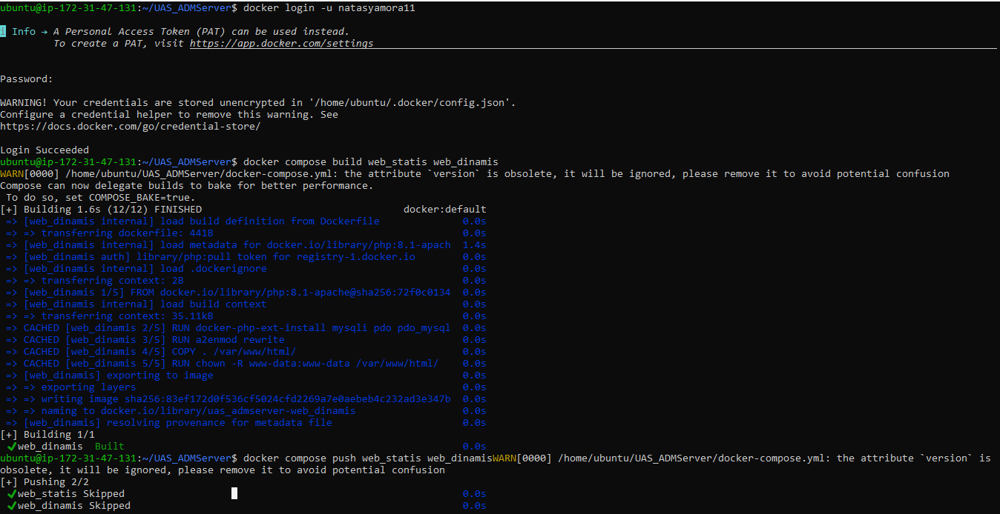
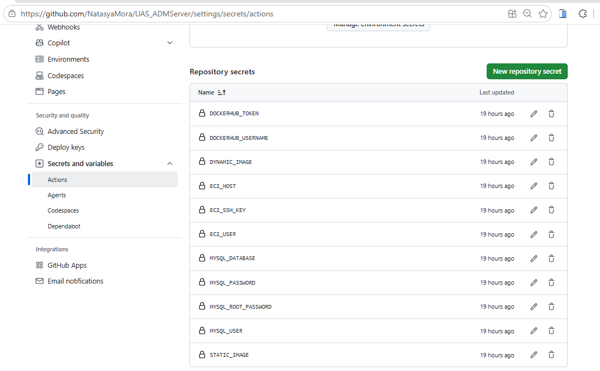
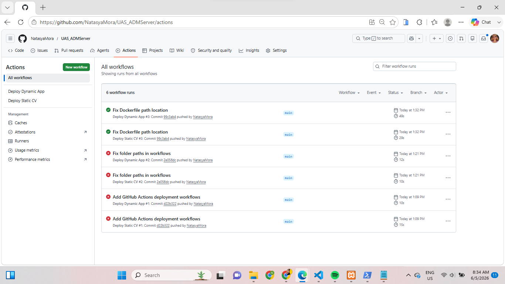
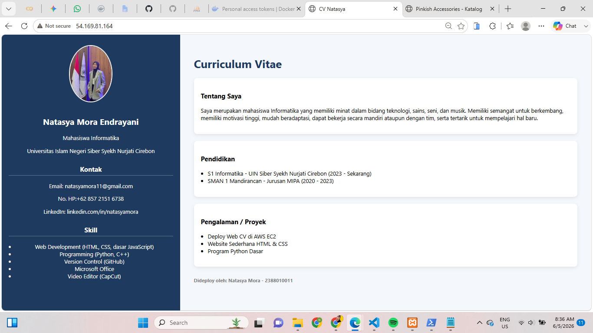
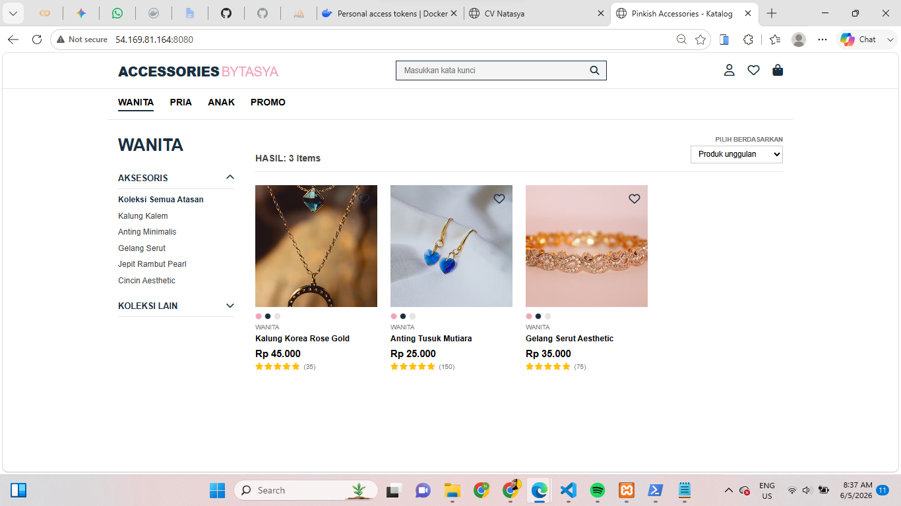

# UAS

1. Buat Instance baru

2. Buat Repositori di Docker

3. Install Docker dari repository resmi Docker

4. Upload Folder Project ke EC2

5. Login Docker ke EC2

6. Push Project dan Set-up Github Secret

7. Set up Github Action

8. Test Menjalankan Web Statis dan We Dinamis

